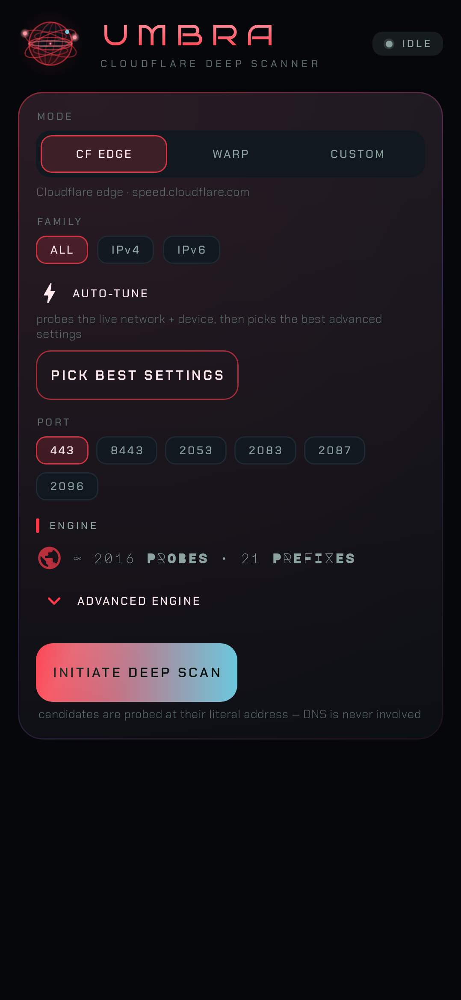
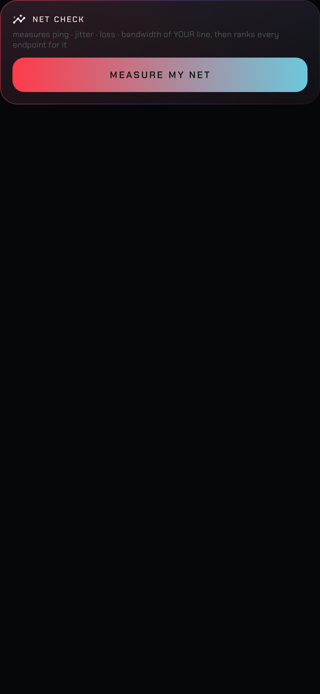
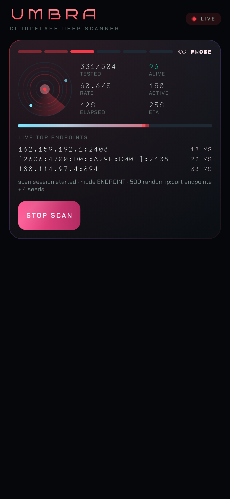
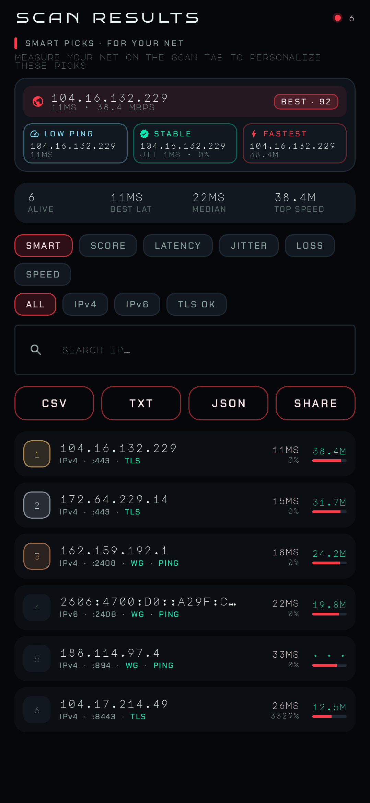
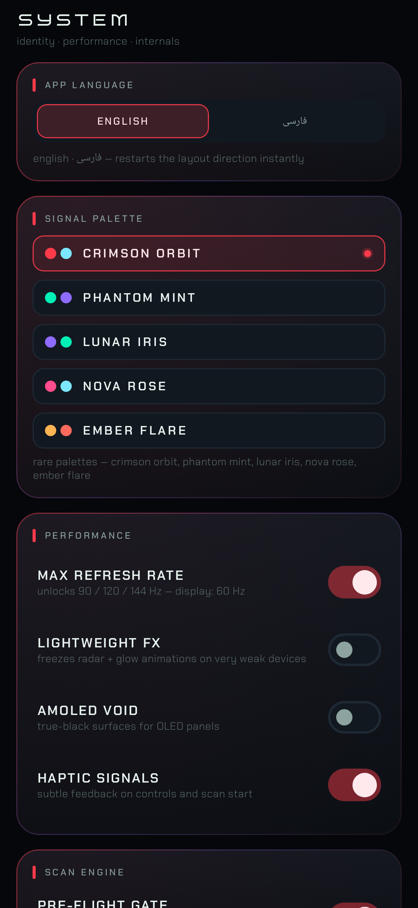
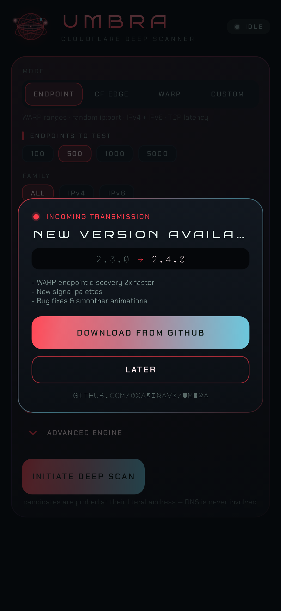
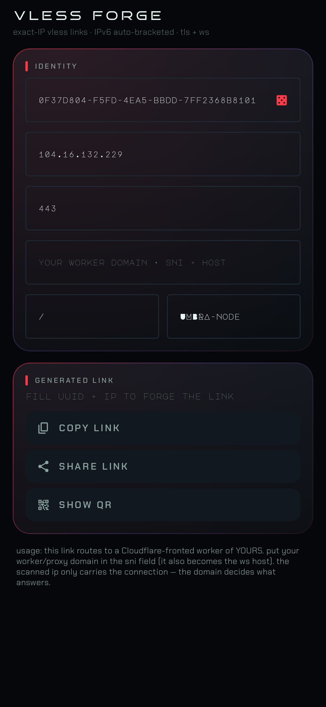

  

<h1 align="center">U M B R A</h1>

  <strong>A native Android scanner that hunts for the fastest Cloudflare and WARP endpoints hiding in your network — and turns them into ready-to-use VLESS configs.</strong>

  
  
  
  
  
  
  

---

## Why UMBRA

Your connection to Cloudflare's edge is only as good as the *specific IP* your network happens to reach. Some Cloudflare IPs answer in 15 ms with zero loss; others sit behind congested routes and quietly throttle your throughput. Cloudflare's own client never tells you which IP you got — and never lets you choose.

**UMBRA flips the table.** It samples the live Cloudflare and WARP address space directly from *your* device, measures what your network *actually* delivers to each candidate — latency, packet loss, TLS handshake, real download speed — ranks everything for you, and generates a VLESS config bound to the winner.

No root. No Termux. No server. ~2 MB.

---

## What's new in v3.8.1 — the full-codebase bug hunt (7 fixes)

*“تمام باگ‌های برنامه رو رفع کن و تمام مشکلاتش رو”* — fix every bug in the app, functional and visual. A full audit of every layer (engine, net stack, controller, settings, export, every screen and component) turned up seven real defects, all fixed and pinned with regression tests (183/183 green, live WG handshake re-verified):

1. **The mode-switcher could silently re-arm the fake-endpoint bug.** Passing through ENDPOINT mode turned the TLS-verify and speed-test toggles OFF (endpoint mode doesn't use them) — but switching back to EDGE/CUSTOM never turned them back ON. An EDGE scan then ran with TLS verification disabled, and on DPI-filtered networks (this app's entire audience) `alive = tcp-alive` means **fake endpoints again** — the exact v3.7 complaint, reborn through the mode switcher. Worse, the poisoned state was saved to disk, so restarts inherited it. Your pre-ENDPOINT toggle choices are now snapshotted and restored on the way out (and *your own* off-choices survive the round trip untouched).
2. **Progress could never quite reach 100% (and the pool was overcounted).** The random endpoint draw deduplicates against itself — but not against the 4 census-verified seeds the engine prepends. With a pinned port, a 500-endpoint scan over the 4064-host v4 pool collides with a seed pair about half the time: the pair was probed twice, the result store merged the duplicates, and the tested counter could never reach the announced candidate count. The pool is now deduplicated on `ip:port`, seeds first.
3. **A handshake-validated endpoint could report “loss 100%”.** Loss was computed from in-tunnel pings only — but plenty of perfectly good WARP endpoints complete every handshake while their data plane rate-limits or drops the tiny ICMP echo. The Done panel then showed a *validated* best endpoint with a 100%-loss stat: a self-contradiction users read as “this endpoint is broken”. Loss now counts probe rounds where the endpoint answered *nothing* (no handshake, no ping) — a completed handshake is a successful round, because the handshake IS the aliveness proof.
4. **The “best endpoint” showed no port.** In ENDPOINT mode the port is half the endpoint (random ports!), and an IPv6 winner without brackets is ambiguous garbage. The Done panel's best endpoint and the live top-5 board now show the full `[ip]:port` — bracketed for IPv6, directly paste-able.
5. **Persian labels in stat cells were glyph-torn.** The stat-cell component kept a fixed 1.2sp letter-spacing for every language; on connected Arabic script that tracking visually tears the letters apart (the hero and tagline rows already had the script guard — the most-used component had missed it).
6. **The boot splash was see-through to touches.** For its 1.15 s lifetime every tap fell through the splash to the live UI underneath — nav items and buttons could be triggered blind. The splash now consumes pointer input like the update dialog's scrim.
7. **Codec cleanup.** A dead elvis (`x?.let { put } ?: put(0)`) on a non-null field in the persisted-results encoder — harmless but misleading; simplified.

> **Every bug found in the audit, fixed and regression-pinned — with live WireGuard validation re-confirmed after the engine changes. Install v3.8.1 over any v3.5.x–v3.8.0, same signature.**

---

## What's new in v3.8.0 — real endpoint validation (the anti-fake release)

The field report was blunt: *“بخش وارپ رو کامل حذف کن — بخش اندپوینت مشکل داره، هیچ کدوم از اندپوینت‌هایی که میده کار نمیکنن، انگار فیک هستن”* — remove the WARP section entirely, the endpoints it hands out don't work, they seem fake. The report was **right**, and the root cause was v3.7's own definition of "alive":

1. **A TCP connect was never proof of an endpoint.** Cloudflare's anycast edge accepts TCP on :443 from *every* edge IP — whether or not that address serves WARP on that port. v3.7's "pure TCP" endpoint scan reported exactly those TCP-alive addresses, and when you pasted `ip:port` into WireGuard / v2rayNG / Hiddify, nothing answered. v3.8 validates every endpoint the way BPB-Warp-Scanner does: **a real Noise_IKpsk2 WireGuard handshake over UDP, from a silently-registered identity, to that exact ip:port.** Only endpoints whose handshake is *answered* (plus the in-tunnel ICMP ping that follows) are reported. Live-verified from this build: **27/120 random endpoints handshake-validated, best 188.114.96.1:2408 at 6 ms, in-tunnel pings included.**
2. **The WARP section is gone — completely.** The mode tile, the WARP/WARP+ flavor switch, the license-key field, the port sweep, the pre-flight gate and its settings card: all removed. What remains of "WARP" is internal plumbing you never see: the endpoint scan registers/reuses an identity silently (15-minute in-process TTL + disk fallback + pinned-IP SNI-routed registration on filtered networks), because a WireGuard handshake needs a registered key — WARP responders drop unknown keys with zero replies (live-verified with a ghost key).
3. **Zero-result scans diagnose themselves.** If no endpoint answers, the Done panel names the world you're in: the probe-failure tally (*handshake timeout ×N*), the independent NTP-witness verdict (no UDP at all / Cloudflare filtered / WARP-ranges-filtered — each with a different remedy), and whether a system VPN is swallowing your UDP. No silent empty boards, ever.
4. **4 census-verified seed endpoints ride at the head of every scan** (188.114.96.1:2408 and friends) — a healthy network shows validated endpoints within the first seconds, an unhealthy one treats them as ordinary failing probes. IPv4 + IPv6 both supported (half/half split, d0/d1 embedded-v6 twins); auto-tune picks the BPB 3/5/7 handshake-retry ladder and a 2000 ms WG timeout floor for you.
5. **Visual fixes for the Persian UI.** The app ships a full فارسی translation but the layout stayed LTR — Persian text sat left-aligned in a mirrored-looking frame. The whole UI now mirrors properly in RTL (nav order, paddings, chevrons), exactly like v2rayNG/Hiddify do in FA; Latin technical tokens (IPs, ports, WG) stay perfectly readable via bidi.
6. **Migration with respect (again).** Stored mode ordinals are bridged once: WARP-mode users land on the new ENDPOINT scanner (the mode that now actually validates), CUSTOM stays CUSTOM, ENDPOINT stays ENDPOINT — the same persisted settings otherwise.

> **Endpoints that actually work in WireGuard / v2rayNG / Hiddify — not TCP-alive fake ones. Install v3.8.0, press the big button, copy the winner.** Same signature, installs in place over any v3.5.x/v3.6.x/v3.7.x.

---

## What's new in v3.7.0 — the ENDPOINT scanner (superseded by v3.8.0: TCP-only validation proved fakeable)

This round's direction came straight from the field: *“من اصلا اسکنر وارپ‌ها رو نمی‌خوام — اسکنر endpoint می‌خوام که IPv4 و IPv6 داشته باشه”* — the BPB-Warp-Scanner workflow, on the phone. v3.6.2 had *proven* (VPN sensor + NTP witnesses + gate verdict) that the reporting device's network silently drops every UDP packet to Cloudflare — which means a WireGuard-handshake scanner can never produce results there, no matter how correct it is. So v3.7 ships what that network actually needs:

1. **A new ENDPOINT mode — now the app's default and first tile.** It does exactly what BPB-Warp-Scanner does on a server: draw **random `ip:port` endpoints** from the Cloudflare WARP pool (162.159.19x/188.114.9x/8.x /24s + the `2606:4700:d0::`/`d1::` IPv6 twins of every v4 — the live-verified embedded pattern, BPB's uniform-random /48 sampling mostly lands on addresses that don't exist), give **each endpoint its own random port** from the 55-port canonical WARP list (or pin one — 2408, 894, 443, 928…), and probe it with **pure TCP handshake latency**: N attempts per endpoint (BPB's 3/5/7 retry ladder, auto-picked from measured RTT), average latency + jitter + loss, ranked. **No WireGuard. No registration. No UDP.** It is the only mode that can produce results on a UDP-blocked network — and it's live-verified from this build: 60/120 endpoints alive in seconds, best 162.159.192.102:443 at 4 ms.
2. **IPv4 + IPv6 first-class.** The family picker drives a true BPB-style half/half split; the completion line reports the v4/v6 aliveness split ("v6 0" on a v6-less route is now *visible*, not mysterious). IPv6 endpoints copy in proper `[2606:4700:d0::a29f:c001]:2408` bracketed form — the old copy action produced ambiguous garbage for v6.
3. **Endpoint-count presets instead of CIDR math.** `100 / 500 / 1000 / 5000` chips + a 50–20000 slider — the BPB "quick/normal/deep" mental model, one endpoint = one probe, estimate == truth. AUTO-TUNE calibrates endpoint mode too (RTT-scaled count + retry ladder, family detection via the live v6 probe).
4. **Mode migration with respect.** WARP (the handshake mode) stays available as the third tile for networks where UDP works; anyone whose stored default was WARP is moved once to ENDPOINT (the mode their network can actually deliver), and re-selecting WARP sticks.

> **Want the BPB panel workflow on your phone — pick the best endpoint IP:port for v4 AND v6? Install v3.7.0, press the big button, done.** Same signature, installs in place over any v3.5.x/v3.6.x.

---

## What's new in v3.6.2 — when the network is the bug, name it

The report this round (screenshot, 2026-10-09 23:58): scan completes with verdict *"WARP UNREACHABLE — UDP TO CLOUDFLARE WARP IS BLOCKED OR DROPPED (FRESH IDENTITY, 35 ENDPOINTS × EVERY CANONICAL PO…"* — truncated mid-word, 0/73728 tested, registration API working. First, the scanner itself was **re-proven live within the hour** (full WG handshake + in-tunnel ping against production, plus an independent cross-check implementation that got 4/7 endpoints answering): the engine is healthy. What remains are failure classes the app used to leave *unnamed* — so this release makes the scanner **detect and diagnose its own environment**:

1. **Active VPN detection (the #1 silent WARP killer on Iranian phones).** Every app socket — including UMBRA's UDP probes — is routed *into* an active Android VPN (v2rayNG, Hiddify, …). TCP-only proxy tunnels (VLESS/vmess over ws/grpc-tcp) **drop UDP silently inside the tunnel** — so registration (TCP) succeeds while *every* WARP handshake gets zero replies, and the gate honestly reports "warp unreachable on this network" — a verdict that is actually about the *tunnel*. v3.6.2 detects an active system VPN (`TRANSPORT_VPN` via ConnectivityManager) **before the gate probes**, warns in the live log, and pins the explanation to any negative verdict: *disconnect the VPN and rescan for a verdict about the real network*.
2. **IPv6 rescue rounds.** ISPs that filter the v4 WARP ranges frequently leave v6 untouched (v6 filtering is rare) — so "every v4 probe silent" was never proof WARP is impossible. The gate now probes the v6-embedded twins of the seeds (`2606:4700:d0::a29f:c001` = `162.159.192.1`, …) plus a v6 mini-storm, with the stored identity *and* the fresh one; a single v6 answer adapts the scan onto IPv6 (`Outcome.AdaptFamily` — the engine regenerates its candidate pool on the proven family instead of scanning a dead v4 storm).
3. **NTP witness evidence on negative verdicts.** "UDP is blocked" is three different problems with three different remedies: (a) no UDP at all, (b) UDP works but Cloudflare is filtered, (c) Cloudflare passes but WARP's ranges/ports are selectively dropped. The gate now probes two NTP witnesses (`time.cloudflare.com` = in-network, `216.239.35.0` = out-of-network, both live-verified) before publishing a negative verdict and **names which world you're in** — each verdict now ends with the matching remedy instead of a shrug.
4. **The verdict is no longer truncated.** The Done panel capped diagnosis text at 3 lines — the user's screenshot literally ends with "…CANONICAL PO" mid-word. Diagnosis text now renders up to 10 lines; the evidence, the VPN warning and all three remedies are actually readable.
5. **"Scan anyway" — the pre-flight gate is now a switch.** A hard gate abort leaves no path forward on networks that are (or look) blocked. SETTINGS → SCAN ENGINE → PRE-FLIGHT GATE (on by default) can be disabled after a Blocked verdict; the scan then runs the full duration and the zero-result tally line explains itself. The Blocked verdict text names this option.

> **WARP scan says "unreachable" but you're sure it should work? Install v3.6.2 and read the verdict — it now tells you whether it's the VPN, the ISP, or Cloudflare-side filtering, and what to do.** Same signature, installs in place over any v3.5.x/v3.6.x.

---

## What's new in v3.6.1 — the failure classes that look like "it doesn't work at all"

The report this round: *“اسکنر وارپ‌ها اصلاً کار نمی‌کنن”* (the WARP scanners don't work at all). No crash, no log — so this round every fix is driven by **live experiments against production Cloudflare**, each of which reproduced a total-silent-failure class on its own:

1. **Seeds go stale and anycast is per-country — the gate could false-abort a healthy network.** Live census: `162.159.192.1:2408` (the old first seed) went silent from our vantage while still answering on `:894/:928`; `188.114.96.1` flaps minute-to-minute; most `8.x` prefixes were dark all day. Anycast lands every country on a *different* Cloudflare PoP — a seed that works in one country can be dead in another. v3.6.0's gate concluded *"warp unreachable on this network"* from seed silence **alone** — on a network where the seeds are stale but thousands of pool IPs answer, that abort killed a perfectly fine scan. The gate now runs a **mini-storm of 32 random pool endpoints** (seeded from the real scan pool, 2 per prefix) between the seed check and any verdict: any random endpoint answering → path proven, storm proceeds. *"Blocked"* now requires silence across seeds **and** random endpoints **and** a fresh identity **and** every canonical port — and the seed list itself was refreshed from the live census. This was the bug that made v3.6.0 look *more* broken than v3.6.0's own fixes deserved on unlucky networks.
2. **Dead identities are silent — verified with a ghost key.** We registered a real identity, then probed production endpoints with a *never-registered* key: **zero replies on every endpoint** (WireGuard's anti-enumeration). A purged/expired identity therefore looks *exactly* like a dead network — and on networks where the registration API is blocked, the persisted disk identity is the only one available, so the scan runs the full duration, finds nothing, and shows no error. v3.6.1 makes the fresh-identity round also run against the random pool (a fresh key that answers where the stored one was silent = the identity was dead, and it self-heals by swapping it in), and when the API is unreachable and nothing answers, the verdict and the zero-result scan line now say plainly: *the stored identity may be expired — WARP drops unknown keys silently; retry where the registration API is reachable*.
3. **Registration now survives DNS poisoning — pinned-IP, SNI-routed.** `api.cloudflareclient.com` resolving to a dead IP (DNS poisoning / filtered resolvers) used to kill fresh registrations, forcing the app onto the aging disk identity. Verified live: Cloudflare's edge routes by SNI, so **any** serving CF IP with SNI/Host `api.cloudflareclient.com` reaches the same origin API with a valid certificate — the registration now falls back to pinned IPs (`104.16.192.82`, `104.16.24.84`, `162.159.192.1`, `188.114.96.1`) when the domain is unreachable. The pinned route was live-tested end-to-end: an identity registered through a pinned IP completed a real WireGuard handshake (A/B against a domain-route identity on the same endpoints).

> **WARP scan aborts quickly with "warp unreachable", or runs fine but finds nothing, or registration fails on your network?** Install v3.6.1 — same signature, installs in place over any v3.5.x/v3.6.0.

---

## What's new in v3.6.0 — the scanner that diagnoses its own network

The report this round: *“اسکنر وارپ‌ها بازم مشکل داره”* (the WARP scanner still has problems). The protocol stack was already live-verified — so this release attacks the two things that could still make a WARP scan fail *silently* on a real, censored network:

1. **The WireGuard replay window could swallow every handshake after a restart.** UMBRA's TAI64N timestamps were "whitened" to 2²⁴-ns granules, so every monotonic bump jumped the sequence **16.7 ms into the future**. WireGuard responders remember the newest timestamp they have ever accepted *for your identity, server-side*. After a burst of probes the sequence ran seconds ahead of the wall clock — and when the app restarted and reused the persisted disk identity (exactly what happens on networks where the registration API is blocked), the fresh process started at wall-clock time, **below the server's stored mark**, and every single initiation was silently discarded as a replay: scan runs, finds nothing, no error anywhere. The timestamp now follows wireguard-go exactly — full-resolution nanoseconds, 1 ns bumps — so even 100 000 rapid initiations stay ~0.1 ms ahead of the clock (the old code: minutes), and the high-water mark is **persisted next to the identity** so a restarted process always resumes above it. Verified live against production WARP endpoints after the change.
2. **A pre-flight gate now proves the path before the storm.** The engine used to throw thousands of probes at the network and, when UDP was blackholed by the ISP or the persisted identity had gone stale, the user waited the whole scan duration just to read "0 verified of 4608" — indistinguishable from "the app is broken". Before the storm now: two anycast seed endpoints get a real WireGuard handshake on your chosen port. If they answer → storm proceeds as configured (with the seed RTT logged). If they are silent → a **fresh identity** is registered and the seeds are retried (stale-identity detection). If still silent → every canonical WARP port is swept: any port that completes a real handshake becomes the scan's port list (per-port ISP blocking is detected and **adapted around**, with a tighter probe budget), and if nothing answers at all the scan ends immediately with an honest diagnosis — *"warp unreachable on this network — try EDGE mode or a different network"* — instead of ten wasted minutes. On API-blocked networks the identity is preserved and the scan proceeds with a clear warning about what "empty" would mean.
3. **Zero-result scans now say why.** Every probe's failure is tallied live into short classes, and a WARP scan that ends with zero verified endpoints appends the top reasons to its final line — *"wg probe storm done · 0 verified of 4608 — handshake timeout ×4210 · icmp port-unreachable ×388"* — which is also what the Done panel shows. A timeout wall means UDP filtering; a port-unreachable wall means the endpoints are rejecting; cookies under load mean alive-but-throttled. The scanner finally tells you which world you're in.

> **WARP scan runs fine but finds nothing (especially right after a restart, or on a filtered network)?** Install v3.6.0 — same signature, installs in place.

---

## What's new in v3.5.2 — the zombie-scan release

The user's screenshot (v3.5.0, WARP mode) showed a scan stuck at `0/4608 tested`, elapsed ticking, `0.0/s`, one amber line — `internal error in scan-engine — NoClassDefFoundError: v1.W` — and a STOP button that did nothing. The v3.5.1 fix killed that crash at the root; this release fixes what the screenshot revealed BEYOND the crash itself:

1. **A crashed engine used to leave the session Running forever.** The scan job caught `Exception` — but `NoClassDefFoundError` and friends are `Error`s. They escaped to the crash-journal net (good), and then… nothing: `finalize()` never ran, the UI stayed on the live scan screen with the timer ticking, the ongoing notification never ended, and STOP silently cancelled an already-dead job. The only way out was force-killing the app. Errors are now caught, journaled **with the full stack trace**, logged honestly, and the scan fails into the Done panel with the reason — the session can never zombie again. STOP on a dead engine is also a defense-in-depth path that always closes the session.
2. **NETSENSE / smart-ranking NaN-proofing.** A missing or corrupt value in the persisted network profile used to parse as `NaN` — silently poisoning the grade, rendering “NaN ms” on the card, and NaN-ing every endpoint score through the relative-latency math (sorting becomes meaningless). Corrupt or absent numbers now read as “unknown”. The persisted result codec got the same hardening.
3. **Test seams done properly** — the engine runner is now injectable, which is what made the zombie scenario a real regression test (7 new tests, 138/138 green): engine `Error` → Done with reason; STOP on dead engine → session closed; STOP on live engine → cooperative cancel; NaN guards ×3; `CrashGuard.record` journaling.

> **A scan that hangs forever at 0 tested with an amber error line?** Install v3.5.2 — same signature, installs in place over any v3.5.x.

---

## What's new in v3.5.1 — the device-side crypto fix

The v3.5.0 handshake rewrite was live-verified on the build machine — and still died on real phones. The crash journal told the whole story in one line:

> `java.lang.NoClassDefFoundError: v1.W` → `Caused by: NoSuchFieldError: No field TWO … in class java.math.BigInteger` — `coroutine[scan-engine]`, Android 11 (API 30)

1. **The WARP engine crashed at class-init on every real device.** The X25519 implementation used a BigInteger constant that exists on modern desktop JDKs (OpenJDK 21) but **not in Android's `java.math.BigInteger` at any API level**. The Kotlin compiler happily compiles it (it resolves `java.*` against the desktop JDK that runs Gradle), the desktop unit tests pass, the live handshake passes — and then the first WARP probe on a phone kills the whole scan with `NoSuchFieldError`. This is why v3.5.0 “found no WARP at all”: every endpoint died before its first packet. All crypto constants now derive from `BigInteger.valueOf(2)`, portable across every JDK and every Android ever shipped.
2. **A whole bug class is now regression-tested.** The new `JdkPortabilityTest` greps production sources for a denylist of desktop-JDK-only members (that TWO field, `java.net.http`, `String.formatted`, `stripIndent`) that pass every JVM test and crash only on devices — the exact trap v3.5.0 fell into can never silently return.
3. **TAI64N timestamps: monotonic *and* whitened, plus a dormant carry bug.** The v3.5 monotonic bump advanced timestamps by +1 ns, which leaked the rapid-call count into the whitened low 24 bits; the bump now advances whole whitened granules, preserving both invariants. Writing it properly also exposed that the (previously unreachable) seconds-carry incremented the **high** word of the 8-byte seconds field instead of the low one — fixed and covered.
4. **Flaky-test hardening** — the CrashGuard journal test raced a real dispatcher under `runTest`'s virtual clock; it now joins the failing job deterministically. The suite runs green on three consecutive full reruns (131/131) and the live WireGuard handshake test passes against production Cloudflare from the fixed code.

> **v3.5.0 finds no WARP endpoints on your phone?** That was this crash, not your network. Install v3.5.1 — same signature, installs in place.

---

## What's new in v3.5.0 — the WARP-scan-is-finally-real release

The bug report was simple: *“وارپ مشکل داره، اسکن درست انجام نمی‌شه”* (WARP has a problem — the scan doesn't work correctly). It was right, and the root cause took live packet-level testing to find:

1. **Every WARP handshake since v3.3 was silently dropped by Cloudflare.** The probe wrote the account's `client_id` into the WireGuard reserved bytes (bytes 1..3 of every packet header) — a borrowed “Xray trick” that could never be verified while UDP was blocked in the dev sandbox. When the sandbox finally allowed UDP egress, a byte-for-byte differential test against production WARP endpoints proved the opposite: **Cloudflare's servers drop any packet whose little-endian type word is not exactly 1/2/4** — non-zero reserved bytes mean the packet is discarded before the handshake even starts. Every probe timed out; the scan “ran” but could never produce a verified endpoint. The fix is the standard wireguard-go / wgcf behavior: reserved bytes are zero on all outgoing packets. The fixed build was then verified **live, end-to-end**: a full Noise_IKpsk2 handshake + an ICMP echo request *inside* the encrypted tunnel, answered with a 7 ms ping reply from `188.114.96.1:2408`.
2. **The anti-DPI noise burst was sabotaging the probe.** Five random garbage packets were sent to the *probe target itself* right before the handshake. WARP endpoints co-host QUIC/MASQUE listeners on the same port — garbage with a high first byte looks like a QUIC long header and gets answered with a 16-byte version-negotiation packet, which was then consumed in place of the handshake response (“bad response length 16”). The noise now follows xray's real `noises` semantics — random public destinations on its own unconnected socket — while the connected WireGuard socket stays pristine.
3. **Probe waits are pollution-proof.** The handshake and in-tunnel-ping waits now skip stray datagrams (wrong size / wrong type byte) and keep waiting within the timeout budget instead of failing on the first junk packet.
4. **TAI64N handshake timestamps are strictly monotonic.** WireGuard responders reject initiations whose timestamp is not newer than the last accepted one for the same key. NanoTime-derived nanoseconds can jump backwards against the wall clock at second boundaries, quietly replay-protecting away some retry attempts; the timestamp generator now guarantees a strictly increasing sequence process-wide (aliasing bug included in the regression tests).
5. **Full differential test suite against a live-verified reference.** The Python reference implementation used for the packet-level diagnosis was itself validated against production WARP and now regenerates the byte-for-byte Kotlin test vectors (initiation, response, session keys, transport request/reply) — the app speaks exactly the same bytes as the reference that was proven on the real network.

> **WARP scans producing zero results on v3.3–v3.4?** That was this bug, not your network. Install v3.5.0 — same signature, installs in place.

---

## What's new in v3.4.0 — the honest-features release

A fourth full-codebase audit found and fixed what was left: a placebo feature, a hidden memory bomb, and a handful of silent misconfigurations:

1. **WARP+ is now REAL** — the WARP+ toggle used to be cosmetic: nothing ever applied a license key. Picking WARP+ now reveals a license-key field; the key is applied to the registered account through the Cloudflare account API right after registration (the wgcf flow), and the scan log states the outcome plainly — "warp+ license applied" or "key rejected — free warp tier continues". A blank key means free WARP, honestly labelled. The key persists across restarts; plain WARP mode never quietly re-applies an old key.
2. **Mega-sweeps can no longer OOM the app** — a capped 120 000-probe sweep used to materialize every pair coroutine up front *and* keep a result entry for every dead endpoint: on low-RAM devices that was a memory kill before the first probe even answered. The storm now launches through a bounded window (≈2 048 live jobs at any moment) and confirmed-dead probes are counted for progress but never stored — the map only ever holds endpoints worth reading.
3. **Capped sweeps no longer bias the address space** — trimming the candidate list to the 120k budget used to cut from the front, which silently starved the newer 8.x WARP ranges and IPv6 entirely. The trim is now random, so every block keeps its shot.
4. **WARP retries: slider, engine and restore now agree** — the slider offered 8–10 retries while the engine silently clamped at 7; and a restored WARP session showed the TCP attempts value instead of the WG retries Auto-Tune had chosen. Both fixed at the source.
5. **VLESS port garbage is rejected, not rewritten** — a port of "00000" used to parse to 0 and quietly become 1 in the generated link; now it's simply invalid.

> **Running an older build (≤ v3.0.0)?** Install the v3.4.0 APK from Releases — it installs in place (same signature) and fixes the WARP deep-scan crash plus adds the missing NETSENSE (نت‌سنج) card.

---

## What's new in v3.3.1 — the can't-crash-anymore release

A defensive hardening pass over the entire scan pipeline. If any version ever still shows "UMBRA has stopped", this one records the exact reason and keeps running:

1. **Crash journal + last-resort net** — a process-wide uncaught-exception hook records every crash (version, device, full stack trace) to an on-disk journal, visible under **SETTINGS → CRASH LOG** with a one-tap COPY REPORT button. Even a hard crash becomes a pastable, fixable report instead of a mystery.
2. **Coroutine crash nets on every engine scope** — scan engine, foreground service, NETSENSE and the update center now carry `CoroutineExceptionHandler`s: an exception escaping any of them is journaled and logged, and the **process survives**. Uncaught coroutine exceptions are silent process-killers — this closes that class entirely.
3. **The INITIATE DEEP SCAN button press itself is guarded** — the one main-thread call that starts the foreground service (the exact moment "has stopped" dialogs used to appear) now reverts to Idle with an honest message instead of dying on odd OEM restrictions.
4. **Deferred scans are now visible** — starting a scan while NETSENSE is measuring used to be silently swallowed (the button looked dead); the reason now shows in an amber notice on the scan screen.

> **Running an older build (≤ v3.0.0)?** Install the v3.4.0 APK from Releases — it installs in place (same signature) and fixes the WARP deep-scan crash plus adds the missing NETSENSE (نت‌سنج) card.

---

## What's new in v3.3.0 — the WARP-crash release

The scan engine no longer dies mid-scan. A full audit of the WARP data path found the crash users were reporting on filtered networks:

1. **WARP scans no longer collapse on UDP errors (the crash)** — a *connected* datagram socket throws `PortUnreachableException` the moment the OS reports an ICMP error for the destination — which happens constantly when probing thousands of random endpoints, especially on filtered networks. One such exception used to race up the coroutine tree and abort the **entire scan** ("engine failure"). Every UDP send, the socket creation, and every single probe are now exception-proof: a dead endpoint counts as a dead endpoint, and the storm rolls on.
2. **WARP identity survives a blocked registration API** — `api.cloudflareclient.com` is exactly the kind of endpoint that gets filtered. Registration now persists the last working identity to disk (like BPB's `warp.json`) and reuses it whenever a fresh registration cannot be made, instead of aborting the scan outright.
3. **Zero-result scans explain themselves** — when a scan ends with nothing verified, the Done panel now shows the engine's actual last word (blocked registration, capped budget, network state) instead of a silent empty board.
4. **Probe-budget cap** — extreme sweep × samples settings could queue hundreds of thousands of multi-second UDP probes (an overnight "scan" that looks like a hang). The workload is now capped at 120 000 pairs with an honest log line.
5. **New launcher icon** — the cyber-globe artwork, fully re-cut into adaptive (safe-zone), monochrome (Material You themed) and legacy layers for every density.

---

## What's new in v3.2.0 — the second bug-hunt (11 fixes)

A second full-codebase audit (static + regression-tested + live-verified against production Cloudflare) shipped **eleven real fixes**:

1. **"TLS VERIFY off" no longer zero-fills the board** — turning the toggle off skipped the TLS phase, but *alive* still required TLS/HTTP proof, so an EDGE scan ended with an empty board after minutes of probing. TCP-alive endpoints now stay alive and are honestly marked `TCP-ONLY` when you opt out of verification (DPI-fake protection stays fully intact when it's on).
2. **AUTO-TUNE no longer freezes the UI** — the link-capacity step ran a blocking socket download on the **main thread** (up to ~6.7 s, ANR territory). It now dispatches to IO and is actually preemptable by its timeout.
3. **NETSENSE race fixed** — two rapid taps on *Measure* could launch two concurrent measurements that poisoned each other; the guard flag is now set atomically *before* the coroutine launches.
4. **Scan ↔ measurement mutual exclusion, both directions** — starting a scan while NETSENSE was measuring used to corrupt both latency statistics. A scan now defers (with a log line) until the measurement finishes.
5. **No more stuck "scanning…" notification** — with POST_NOTIFICATIONS denied (Android 13+), the *ongoing* progress notification survived the scan forever, undismissable. It's now removed cleanly at completion when the final notification can't be posted.
6. **Honest jitter/loss for NETSENSE** — jitter and loss were pooled across 4 different anycast seeds, so a perfectly stable line graded FAIR (inter-seed RTT spread ≠ jitter) and one blocked seed counted as 25% packet loss. Metrics are now computed per-seed on the most responsive witness.
7. **QR codes no longer jank** — the VLESS QR was encoded synchronously *during composition* and re-encoded on every keystroke; it's now generated off-thread, cached, and only produced for valid links.
8. **Honest WARP probe estimate** — the pre-scan "≈ N PROBES" line ignored the small-block enumeration cap and overstated the workload up to 12× with a high samples setting.
9. **Refresh-rate toggle actually toggles** — switching *Max refresh rate* OFF now resets the window mode (it previously only ever pinned the max mode).
10. **The update dialog is truly modal** — taps on the dimmed scrim used to fall through to the screen behind it.
11. **Smart picks memoized** — the board re-sorted the full result set on every keystroke of the search field; it's now remembered on its exact inputs.

**One-time signature change:** v3.2.0 is signed with a new key (kept in-repo from now on — see *Signing* below). **Uninstall v3.1.1 or older, then install v3.2.0.** Every future update upgrades in place.

---

## What's new in v3.1.1 — the bug-hunt patch

A full-codebase audit shipped **nine real fixes** (each locked in with a regression test):

1. **Results survive a restart** — the persisted smart-pick board was written on every scan but never read back: the results tab greeted you with *NO SCAN DATA YET* after every app restart. The last scan's verified results now hydrate the board on launch, and *Clear board* actually clears them (it used to leave the persisted buckets behind, resurrecting "deleted" results on next launch).
2. **The samples knob is now honest** — small blocks (every WARP `/24`) ignored the *samples/prefix* setting and fully enumerated 254 hosts per block, silently generating ~2.6× more candidates than the on-screen estimate promised and stretching scans just as long. Sampling now respects the knob exactly; the estimate and the engine agree (full enumeration only when you ask for it).
3. **No stale error on verified endpoints** — an endpoint that had already passed full verification could still show an old "timeout" from an earlier phase in its detail sheet.
4. **Latin digits everywhere technical** — on Persian-locale devices, every `%.1f`-style readout rendered Persian numerals inside the Latin mono typeface (fallback glyphs, broken metrics alignment) — and worse, **exported JSON/CSV contained Persian digits, producing invalid JSON**. All technical formatting is now pinned to `Locale.US` (14 call sites swept).
5. **"TLS OK" filter works in WARP scans** — it used to yield an empty list (WARP rows carry their proof in the WireGuard handshake, not in a TLS flag); it now filters on *verified* for both families.
6. **DPI lines can't grade عالی** — a fake-accepting line (perfect TCP, dead TLS) no longer grades EXCELLENT, which used to tilt the smart weights toward raw speed on a line that can't complete a real handshake.
7. **Notification permission asked once** — the system dialog popped on *every* scan start; now exactly once per install.
8. **WARP registration backoff** — the three registration retries fired back-to-back and all hit the same rate-limit window; a 700 ms backoff lets the retry actually land.
9. **Upload metric on IPv6 lines** — the upload probe used the 1.1.1.1 v6 resolver anycast, which doesn't serve the speed SNI, silently nulling the upload number on every v6-capable line.

---

## What's new in v3.1.0 — the NETSENSE release

- **نت‌سنج / NET CHECK** — a new card on the scan tab measures **your own line**: ping (12 interleaved TCP handshakes to Cloudflare seeds), jitter, packet loss, a **DPI-proof real TLS round-trip** (immune to fake-accepting middleboxes), exact-IP download **and upload**, and the IPv6 route. The result grades your network (عالی / خوب / متوسط / ضعیف) and is stored on-device.
- **SMART PICKS · انتخاب‌های هوشمند** — the results board now opens with a recommendation board computed **for your measured line**: the adaptive **BEST**, the **lowest PING**, the **most STABLE**, and the **FASTEST** endpoint — **both WARP and CF EDGE on one screen** (each family keeps its last verified results). Tap any pick to open its full profile.
- **Adaptive ranking (SMART sort)** — the default sort now weighs every endpoint *relative to your own baseline*: a 350 ms endpoint ranks high on a 300 ms line and low on a 40 ms one. Excellent lines → throughput dominates; poor, lossy lines → stability + ping dominate (speed measurements on a rough line are noise).
- **Bug fixes** — the live top-endpoints board no longer shows unverified TCP-alive endpoints during edge scans (DPI fakes used to flash there before TLS verification pruned them); a failed speed test no longer stamps an error onto a fully-verified WARP endpoint; auto-tune + scan now **share one WARP identity** (15-min cache) instead of registering two accounts per session; the boot splash version label is read from the package instead of being hardcoded.

---

## What's new in v3.0.0 — the Crimson Orbit release

  

- **New app icon** — the crimson cyber-globe (adaptive on Android 8+, themed/monochrome on 13+, legacy squircle below).
- **فارسی** — the whole interface now speaks Persian: every screen, RTL layout, and the **Vazirmatn** typeface. Persian phones start in Persian automatically; a language switch lives in SYSTEM.
- **New CRIMSON ORBIT palette** (default) matching the icon, plus the original four.
- **Boot splash** — the orbit globe breathes over the void with a gradient wordmark before dissolving into the app.
- **OrbitGlobe live visual** — a wireframe globe with counter-rotating orbital rings and traveling nodes, drawn in a single canvas (it also fills the empty results state).
- **Podium medals** — gold / silver / bronze tint the top-3 result rows.
- **Bug fixes** — VLESS prefill from the results sheet now works every time (not just once per app launch), the scan log no longer drops lines under concurrency, notifications tint with the chosen palette, and family-filter switches reset the reveal window.

---

## Screenshots

Real renders of the app's actual Compose UI — dark substrate, rare typefaces (Bruno Ace SC · Chakra Petch · Major Mono Display · Vazirmatn), spring physics and neon glow:

| Scan configuration | NET CHECK · نت‌سنج card |
| :---: | :---: |
|  |  |

| Live scan · radar console | Results · smart picks + board |
| :---: | :---: |
|  |  |

| System settings | Update announcement |
| :---: | :---: |
|  |  |

| VLESS generator · QR |
| :---: |
|  |

---

## Feature Matrix

| Capability | Detail |
| --- | --- |
| **Cloudflare edge scan** | Random sampling of 14 IPv4 + 7 IPv6 edge CIDRs (never enumerates whole ranges) |
| **WARP / WARP+ scan** | Endpoint hunt across 14 BPB-verified ranges — the classic `162.159.192.0/24`-family blocks **plus the newer `8.x` WARP space** many ISPs have not throttled yet |
| **Real WireGuard validation** | Every WARP endpoint is proven by a **full Noise\_IKpsk2 handshake over UDP** followed by an **ICMP echo ping inside the encrypted tunnel** — the same guarantee BPB-Warp-Scanner gives, without shipping a 30 MB xray core |
| **Fresh WARP identity per scan** | Registers a free account on `api.cloudflareclient.com` (the BPB `warp.go` flow) so handshakes authenticate against Cloudflare's production WARP service |
| **UDP noise (anti-DPI)** | Optional burst of 5 random packets before every handshake — the BPB trick that keeps WARP alive on ISPs that pattern-match the first packet |
| **Port sweep** | Single port, or full 55-port WARP sweep (BPB's verified list) for networks that block `2408` |
| **TCP quality** | Multi-attempt connect (1–10 tries) with per-IP latency and packet-loss statistics (edge mode) |
| **TLS verification** | Real handshake against each candidate — valid cert required, per-port SNI (edge mode) |
| **True speed test** | HTTPS download **directly from the candidate IP** with SNI/Host pinned to `speed.cloudflare.com` — DNS cannot redirect the measurement |
| **Ranking engine** | WARP results ranked by in-tunnel ping RTT + loss; edge results by the composite score |
| **NET CHECK / نت‌سنج** | Measures the user's own line — ping, jitter, loss, DPI-proof TLS RTT, exact-IP download **and upload** (POST `speed.cloudflare.com/__up`), IPv6 — and grades it عالی/خوب/متوسط/ضعیف |
| **SMART PICKS / انتخاب‌های هوشمند** | Adaptive BEST · LOW PING · MOST STABLE · FASTEST per family (WARP + CF EDGE side by side), baseline-relative scoring, weights that shift with the measured grade of your line |
| **VLESS generator** | One-tap `vless://` URLs, QR codes, IPv6 correctly bracketed (`vless://uuid@[2606:4700:...]:443`) |
| **AUTO-TUNE** | Single-tap network calibration — the WARP port sweep now validates each port with a **live WireGuard handshake**, so the tuned port list is guaranteed to carry WARP traffic on your network |
| **Export** | Results as CSV, JSON, or TXT |
| **Self-update** | Silent GitHub release check on launch (24 h throttle) + animated in-app announcement with one-tap download |
| **English + فارسی** | Full bilingual interface with RTL mirroring, Vazirmatn typography, and a system-integrated per-app language config |
| **Background scans** | Foreground service with live notification + STOP action |
| **Privacy** | Zero analytics, zero trackers, zero data collection — everything stays on device |

---

## Download

Grab the latest signed APK from the **[Releases](https://github.com/0xAKIRAVX/UMBRA/releases)** page.

| | |
| --- | --- |
| Latest version | **v3.8.1** (build 23) |
| Requirement | Android 8.0+ (API 26) |
| Architecture | Universal (all ABIs) |
| Permissions | `INTERNET`, `FOREGROUND_SERVICE`, `POST_NOTIFICATIONS` — nothing else |

> Install like any sideloaded app: download, open, allow "unknown sources" if asked, done.
>
> ⚠ **Upgrading from v3.1.1 or older?** The v3.2.0 APK is signed with a new release key that now lives **inside the repo** (`keystore/umbra-release.jks`) so every future build keeps the same signature — Android refuses an in-place update across different keys, so **uninstall the old UMBRA once, then install v3.2.0**. From this version on, updates install over each other seamlessly. Nothing of value is lost (scans are per-session, settings take seconds to re-pick).

### Signing

The release keystore is **committed to this repository** (`keystore/umbra-release.jks`, credentials in `app/keystore.properties`). This is a deliberate trade-off: UMBRA is a personal, sideloaded utility, and the build machine gets rebuilt regularly — an out-of-repo key would silently rotate the signing identity on every rebuild and force every user to uninstall/reinstall on each update. Keeping the key in-repo pins the signature forever. If this project ever becomes widely distributed, rotate to a private key and treat the in-repo one as burned.

> ⚠ The in-repo key means anyone can build an APK that Android accepts as an update to UMBRA. Only ever install builds you produced yourself or downloaded from this repository's Releases page.